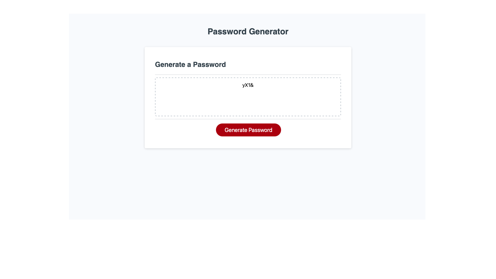

# password-generator

Generate a random password for your personal use.

I was motivated to implement everything that I have learned thus far about Javascript and produce a website that could generate a random password by asking the user what parameters they would like to include.

I built this website to see how well I was able to apply the knowledge I gained and also to gauge how much I was able to take in, understand, and showcase what I have learned. 

Once fully functional, my password generator website will be able to create a password based off of the the criteria specified by the user.

I learned how resourceful I need to be and how much more I had to learn. It is clear that I need a deeper understanding of how I can use what was taught to connect and get the desired result. 

Below is a snap of the progress I had made thus far:

Resources I used:

[Youtube video that taught me how to use onclick function](https://www.youtube.com/watch?v=xj0DQI7N4Go)

[Stack Overflow](https://stackoverflow.com/)

[Code Repper](https://www.codegrepper.com/)

[W3schools](https://www.w3schools.com/)